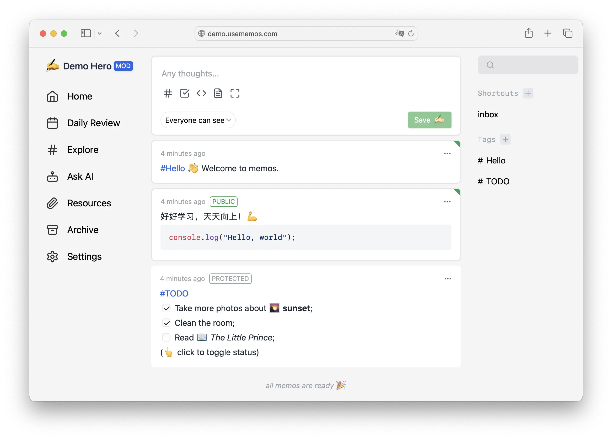

<p align="center"><a href="https://usememos.com"></a></p>

<p align="center">
  <a href="https://github.com/usememos/memos/stargazers"></a>
  <a href="https://hub.docker.com/r/neosmemo/memos"></a>
  <a href="https://discord.gg/tfPJa4UmAv"></a>
</p>

<p align="center">
  <a href="https://demo.usememos.com/">Live Demo</a> •
  Discuss in <a href="https://t.me/+-_tNF1k70UU4ZTc9">Telegram</a> / <b><a href="https://discord.gg/tfPJa4UmAv">Discord 🏂</a></b>
</p>



## Features

- 🦄 Open source and free forever;
- 🚀 Support for self-hosting with `Docker` in seconds;
- 📜 Plain textarea first and support some useful Markdown syntax;
- 👥 Set memo private or public to others;
- 🧑‍💻 RESTful API for self-service.

## Deploy with Docker in seconds

### Docker Run

```docker
docker run -d --name memos -p 5230:5230 -v ~/.memos/:/var/opt/memos neosmemo/memos:latest
```

> `~/.memos/` will be used as the data directory in your machine. And `/var/opt/memos` is the directory of the volume in docker and should not be modified.

### Docker Compose

Example docker compose YAML file: [`docker-compose.yaml`](./docker-compose.yaml).

You can upgrade memos with the following command.

```sh
docker-compose down && docker image rm neosmemo/memos:latest && docker-compose up -d
```

### Other guides

- [Deploy on render.com](./docs/deploy-with-render.md)
- [Deploy on fly.io](https://github.com/hu3rror/memos-on-fly)

## Contribute

Contributions are what make the open source community such an amazing place to learn, inspire, and create. Any contributions you make are greatly appreciated. 🥰

See more in [development guide](./docs/development.md).

### Products made by Community

- [Moe Memos](https://memos.moe/) - Third party client for iOS and Android
- [lmm214/memos-bber](https://github.com/lmm214/memos-bber) - Chrome extension
- [Rabithua/memos_wmp](https://github.com/Rabithua/memos_wmp) - WeChat MiniProgram
- [qazxcdswe123/telegramMemoBot](https://github.com/qazxcdswe123/telegramMemoBot) - Telegram bot
- [eallion/memos.top](https://github.com/eallion/memos.top) - A static page rendered with the Memos API
- [eindex/logseq-memos-sync](https://github.com/EINDEX/logseq-memos-sync) - A Logseq plugin

### User stories

- [Memos - A Twitter Like Notes App You can Self Host](https://noted.lol/memos/)

### Join the community to build memos together!

<a href="https://github.com/usememos/memos/graphs/contributors">
  
</a>

## License

[MIT License](https://github.com/usememos/memos/blob/main/LICENSE).

## Star history

[](https://star-history.com/#usememos/memos&Date)
