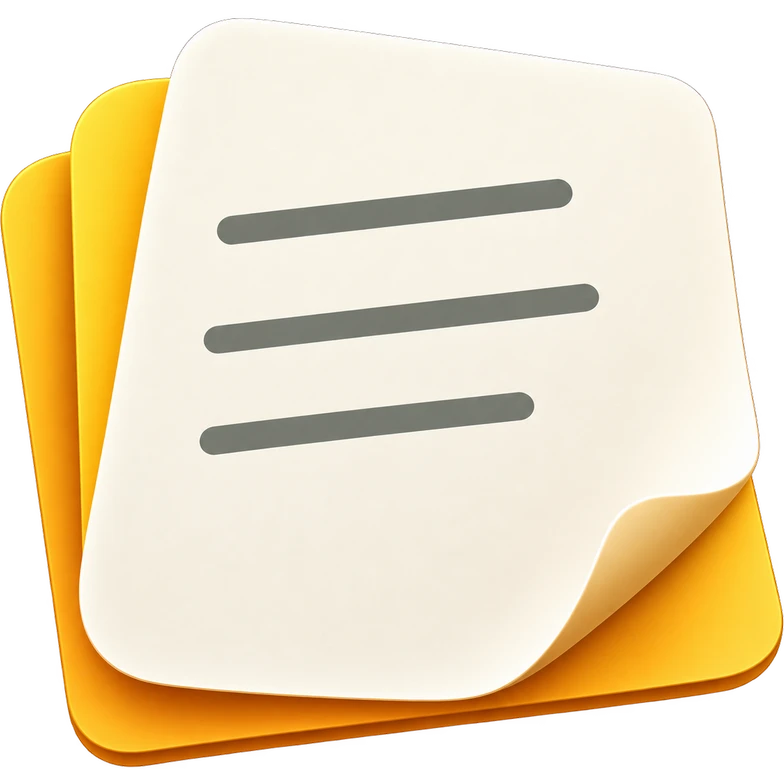

> ✨ Featured sponsor: [CodeRabbit — Industry-leading AI code reviews](https://coderabbit.link/usememos).

# Memos



**Fast enough for every thought. Private enough for all of them.**

Memos is an open-source, self-hosted home for short-form thinking. Daily notes, links, work logs, and snippets flow into a chronological Markdown timeline—on infrastructure you control, without the overhead of an all-in-one workspace.

**[Run with Docker](#quick-start)** · **[Try the live demo](https://demo.usememos.com/)** · [Read the docs](https://usememos.com/docs)

[](https://github.com/usememos/memos)
[](https://github.com/usememos/memos/releases)
[](https://hub.docker.com/r/neosmemo/memos)
[](LICENSE)


## Why Memos?

- **Capture quickly** — Write in Markdown, attach media, and save without choosing a title, folder, or template.
- **Organize lightly** — Revisit notes through the timeline, search, tags, and pins.
- **Share selectively** — Keep memos private or publish only what you choose.
- **Keep control** — Self-host Memos with [zero telemetry](https://usememos.com/features/data-ownership) and [MIT-licensed source](LICENSE).

[Explore all features →](https://usememos.com/features)

## Quick Start

Run Memos with Docker:

```bash
docker run -d \
  --name memos \
  -p 5230:5230 \
  -v ~/.memos:/var/opt/memos \
  neosmemo/memos:stable
```

Other install options are in the [deployment guide](https://usememos.com/docs/deploy).

## Web Clipper

Save pages, selections, and images from your browser straight into Memos as source-linked Markdown. Get the [Memos Web Clipper](https://usememos.com/web-clipper) for [Chrome](https://chromewebstore.google.com/detail/memos-web-clipper/nebaoebnljalfegiidibihhkebeiklbl) or [Firefox](https://addons.mozilla.org/en-US/firefox/addon/memos-web-clipper/).

## Sponsors

<p>
  <a href="https://coderabbit.link/usememos" target="_blank" rel="noopener"><picture><source media="(prefers-color-scheme: dark)" srcset="https://victorious-bubble-f69a016683.media.strapiapp.com/White_Typemark_79b9189d19.svg" /></picture></a>
  &nbsp;&nbsp;&nbsp;&nbsp;&nbsp;&nbsp;
  <a href="https://ssdnodes.com/?utm_source=memos&utm_medium=sponsor" target="_blank" rel="noopener"></a>
  &nbsp;&nbsp;&nbsp;&nbsp;&nbsp;&nbsp;
  <a href="https://www.testmuai.com/?utm_medium=sponsor&utm_source=memos" target="_blank" rel="noopener"><picture><source media="(prefers-color-scheme: dark)" srcset="https://raw.githubusercontent.com/usememos/.github/refs/heads/main/assets/sponsors/testmuai/white.png" /></picture></a>
</p>

Love Memos? [Sponsor the project on GitHub](https://github.com/sponsors/usememos).

## Get Help

Read the [docs](https://usememos.com/docs), join [Discord](https://discord.gg/tfPJa4UmAv), or ask in [GitHub Discussions](https://github.com/usememos/memos/discussions). Found a bug or have an idea? [Open an issue](https://github.com/usememos/memos/issues/new/choose). To contribute, see the [contributing guide](https://usememos.com/docs/development/contributing).
